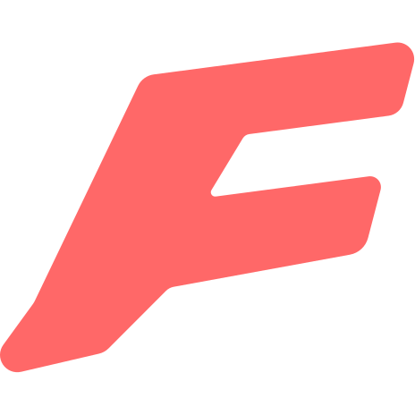

  

<h1 align="center">Finalchat</h1>

## TODO

- [ ] Setup PKCE for OpenRouter https://openrouter.ai/docs/guides/overview/auth/oauth#step-2-exchange-the-code-for-a-user-controlled-api-key

### Chat Features

- [ ] Og image generation
- [ ] Enhance prompt button
- [ ] Work on the mobile experience
- [ ] Allow customization of font
- [ ] Custom 404 page
- [ ] Edit messages
- [ ] Regenerate messages

## Group Features

Groups allow you to use your own key to pay for multiple users at the same time. You also get more advanced control features like:
- [ ] Option to make it possible to view any chats created by group members
- [ ] Option to prevent users from making chats public

1. Users can only belong to 1 group
2. Users may leave a group at any time
